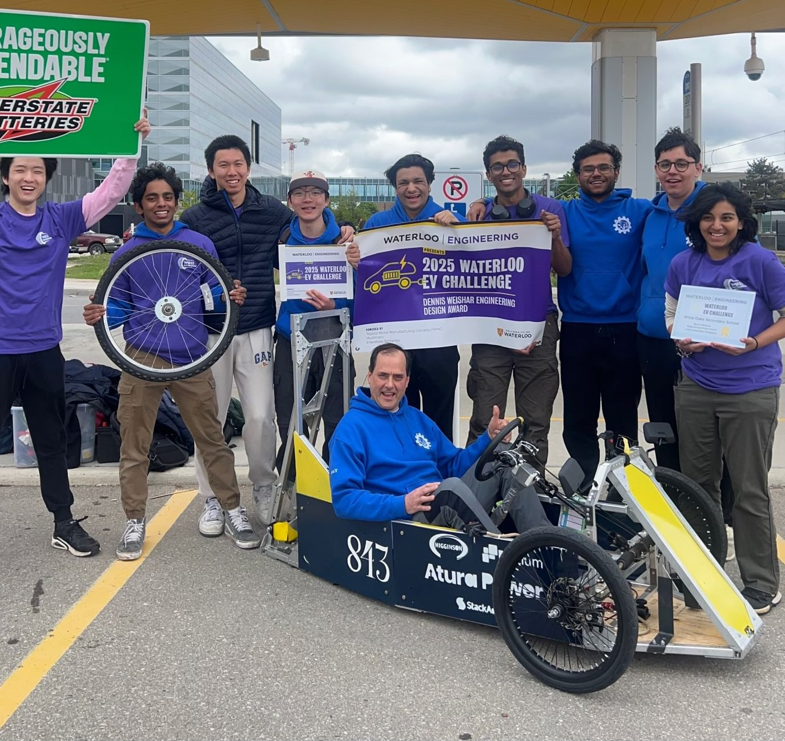

# WarRig X1 - Electric Race Car

This car was designed and built entirely from scratch over the course of just **4 months** by me and a few others in high school for the **University of Waterloo Electric Vehicle Challenge**. The competition was a **70-minute endurance race** running on a strict **12V limit**.

### Highlights:
- ✅ Fully custom-built frame, drivetrain, and electrical systems - topspeed 40 km/h (sustained for an hour)
- ⚙️ Sleepless nights in the shop, CAD sprints, and a whole lot of soldering
- 💥 Our motor controller decided to dramatically *self-destruct* during the race...
- 🏆 ...but we still took home the **Dennis Weishar Engineering Design Award** for innovation and execution!

### Gallery

#### 🛠️ Team in the shop

#### 🏁 Driving the car

#### 🏆 Award winners!

---

Currently working on making a new 4-seater self-driving car with the Town of Oakville - will have some code in here for that soon :P
